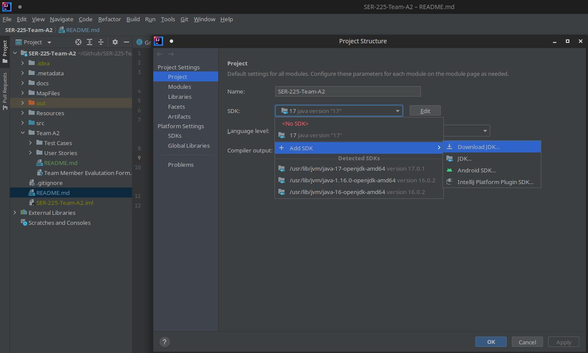

# SER-225 Fall 2021 Team A2

#### [Original GitHub Link](https://github.com/LittleTealeaf/SER-225-Team-A2)

[//]: # (Welcome to the FAll 2021 Team A2's SER-225's repository! If you are reading this from the text file, it is advised to either enable markdown rendering, view on your own repository or fork, or click the link above to view the published repository.)

## What is this project?

*Taken from the original archive provided*
> This is a game created for Quinnipiac's SER225 Agile Development class. Students will be paired up in teams for an entire semester, and will use agile development sprints to work further on this game. This usually involves adding features and fixing bugs (I'm sure there are bugs...)

## How do I use this project?

This is a standalone project, so running this program in either Eclipse or Intellij will work. However, much of this project has been created in IntelliJ, and setting up the project's java will be much easier in IntelliJ. You can download the Community Version of IntelliJ [here](https://www.jetbrains.com/idea/).

### Java 17

If you haven't gotten java recently, you probably are running an out-dated java version. During our work, we decided to update our project to use Java version 17. Since we took advantage of the latest java syntax features, this project will most likely not run on older versions. If you are using IntelliJ, you will be able to just choose to download Java 17 when you select the java version.

The image above is showing the java version selector under the "project settings" (Look under `File`). Additionally, make sure that `Language Level` is also set to the most recent language level.

### Running the Project

There are two main classes used to run the project. First, and the most important, is the `Game.java` class. This can be found at [`src/Game/Game.java`](src/Game/Game.java). Running the main class will launch the full game.

Additionally, there is a level editor that allows you to easily edit each level individually. To run this, you can run the main method in [`src/MapEditor/MapEditor.java`](src/MapEditor/MapEditor.java)

## Documentation

Ok, so you've probably been shown the original documentation link. Additionally, we have the original documentation located at [/docs_archive](docs_archive). Be warned, be very warned. We changed A LOT during our work here, so the documentation can and will be wrong. Specifically, when it comes to the following aspects of the game, assume that the documentation is of very little specific use. However, feel free to read it to understand the general basis of the project.

- Menu Screen, Level Loading, Screen Manager
- Player class
- Game Loop

That being said, many of the changes done have been documented in hopes to explain the madness. These comments are done in a way where in IntelliJ, hovering over any call should display a tooltip that describes that method, or at least if that method was documented.

## Contents of this Repository

Below is a brief overview of the documents contained in this directory, at least those contained in the latest GitHub Repository. Note that some files may be missing to clean the slate for your teams to build on.

This table was taken directly from our final report. Yes, the file names are links, and should take you directly to that folder / file, depending on where you are viewing the markdown file from.

| File                                               | Description                                                                                                                                                                                                                                                |
|:---------------------------------------------------|:-----------------------------------------------------------------------------------------------------------------------------------------------------------------------------------------------------------------------------------------------------------|
| [`Team A2`](Team%20A2)                             | Contains all our working documents as a team. A [`README.md`](Team%20A2/README.md) is provided to give additional insight into the directory's contents                                                                                                    |
| [`Team A2/Test Cases`](Team%20A2/Test%20Cases)     | The final list of all test cases in the project, as markdown files. Each file is labeled by its Bug or Enhancement ID number (SCP-##). A template file “template.md” is also listed as a template for the test case markdown structure.                    |
| [`Team A2/User Stories`](Team%20A2/User%20Stories) | This directory contains the “.docx” of our first wave of test cases and user stories, which we created during Scrum Spring 0. While some were completed, we ended up not continuing with these as described above.                                         |
| [`docs_archive/`](docs_archive)                    | This is the directory containing the original documentation of the project. We specify “archive” because much of the documentation is obsolete with the current state of the project, but a fair chunk is still useful with learning how the system works. |
| [`docs_resources`](docs_resources)                 | All the resources, such as the image used in the project README.md file, stored in one centralized location                                                                                                                                                |
| [`resources/`](resources)                          | All resources pertaining to the java project. This will include Map Files, Music, and Images that the code loads up and runs.                                                                                                                              |
| [`src/`](src)                                      | The source root directory of the project. This is the root folder where all the modules/packages are stored.                                                                                                                                               |
| [`.gitignore`](.gitignore)                         | Ignore files used by git so that IDE-specific files and java compiled files are not committed or pushed during production                                                                                                                                  |
| [`README.md`](README.md)                           | The file you are reading right now                                                                                                                                                                                                                         |