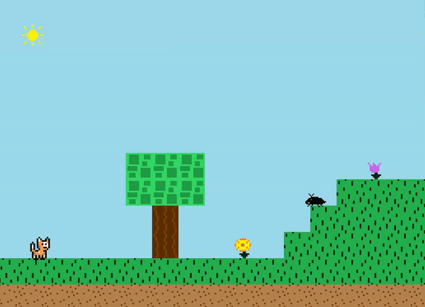
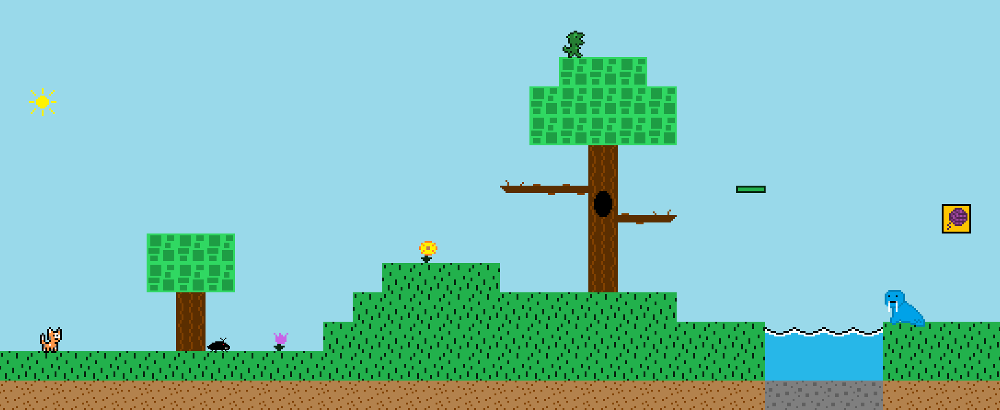
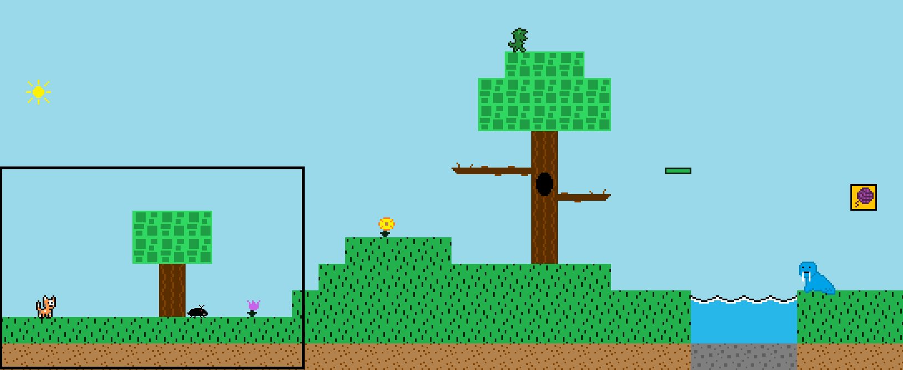
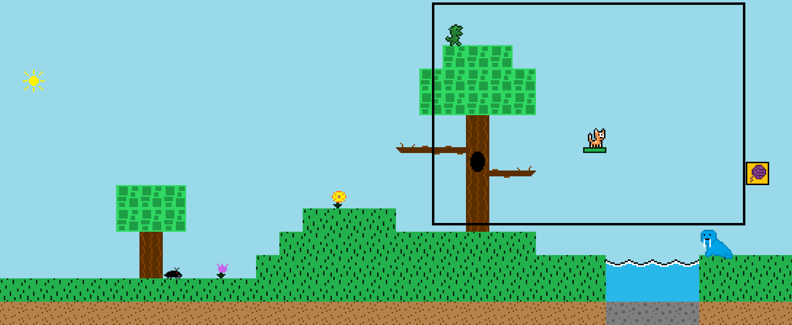

# Navigation Structure
{: .no_toc }

## Table of contents
{: .no_toc .text-delta }

1. TOC
{:toc}

---

# Map Camera

## What is the map camera?

The map camera, which is represented by the `Camera` class in the `Level` package, is the class responsible for keeping track of
which section of a map needs to be shown/updated during a specific time period. If you have ever played a 3D video game, you will have an
idea of what a game map's camera is -- often times you are given the ability in these games to rotate it yourself to see different
parts of the map as you play. In a 2D world, the camera is a lot simpler, as there are only four movement directions -- up, down, left, and right.

Take a look at the below gif:

As the player moves across the map, it's the `Camera` class's job to change what pieces of the map are shown/updated. This is used to give
the appearance that the map is "scrolling" as the player moves. In reality, once the player hits the half way point on the screen (both x direction and y direction),
instead of the player moving forward, the camera actually moves to show more of the map. Once the player reaches an end of the screen,
the camera just stays in place, and in that time the player can move freely until the need to move the camera comes up again.

## How does camera movement work?

Think of the camera as a defined rectangle, with x, y, width, and height attributes. The width and height of the camera are set to the
entire size of the screen.

Below is the entire map image, which is made up of individual tiles. The entire map does NOT fit on the screen all at once.

 
The camera starts at x and y (0, 0) when the map is first loaded. Upon starting the game, the camera moves
to match where the player's start tile is (the player is the cat). The screen size is around 800x600, so you can think of the camera
as the rectangle on this map image. The rectangle shows that a piece of the entire map is being shown to the player on the screen
at a time:

As the player moves throughout the map, the camera follows it to show different pieces of the map.

## Active Map Resources

The camera is also responsible for determining which map tiles, enemies, enhanced map tiles (like the floating platform), and npcs
are a part of the current map that is being shown, meaning those items need to be a part of the `update` and `draw` cycle. In order to not
waste computing resources, the camera is constantly checking if a map item is not in the "updatable" area (such as an enemy has gone too far off-screen).
This is important as wasting time updating and drawing items that do not affect the player can affect FPS and cause the game to slow down,
which is never ideal. 

Map items that are to be included in the `update` and `draw` cycle at a given time are considered "active".
The `Map` class exposes three methods for `getActiveEnemies`, `getActiveEnhancedMapTiles` and `getActiveNPCs` that allow other classes
to retrieve this information. These contain a subsection of each map resource that are currently active, and can be used
for things like collision checking to prevent from having to check EVERY resource in the game. Looking at the above images of the camera example on the entire map image,
it's more apparent how only certain enemies that are in the camera's range need to be included in the `update` and `draw` cycles at
any given time.

The variable `UPDATE_OFF_SCREEN_RANGE` determines the "tile range" that a map resource can be off screen until it is considered inactive.
It is currently set to 4, so if any map resource is more than 5 tiles away off screen, it will be removed from the game cycle until
it comes back into range. Some resources (specifically enemies) have the ability to respawn, meaning they will go back to their
starting location if they were previously inactive and then became active again.

The `Camera` class's `loadActiveEnemies`, `loadActiveEnhancedMapTiles`, and `loadActiveNPCs` methods are called each game loop cycle (each frame)
to determine which map entities are currently active and which ones are not. Frankly, the code for these methods is an abomination
because I couldn't find an easy way to combine them all, so it's three long-ish separate methods that all do relatively the same exact thing
and contain identical code (just on different entity lists).