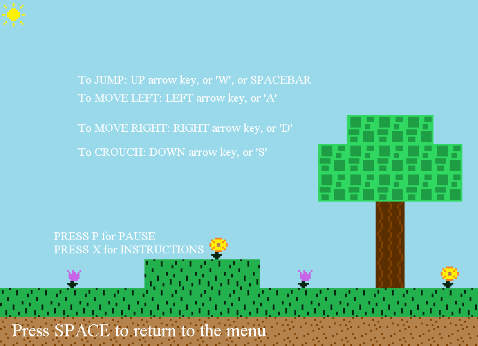

# Navigation Structure
{: .no_toc }

## Table of contents
{: .no_toc .text-delta }

1. TOC
{:toc}

---

# Instructions Screen

The screen handles the logic related to how to play the game. Many users were confused with the functionality
of keys, so this screen will fix the confusion. Also, if the users click 'X' the instructions screen appears.

The class file for it is `InstructionsScreen.java` which can be found in the `Screens` package.

## Functionality

The instructions screen's only real job is to show the player how to play the game. It displays how the user
can walk, jump, and run throughout the game while avoiding enemies.

## Graphics

The background of the screen uses a `Map` specifically made for it (`TitleScreenMap.java` in the `Maps` package), which is the same type of `Map` class which
is used when actually playing the platformer game. While any image could have been used, I thought it'd be more fun to use a map as the background.
