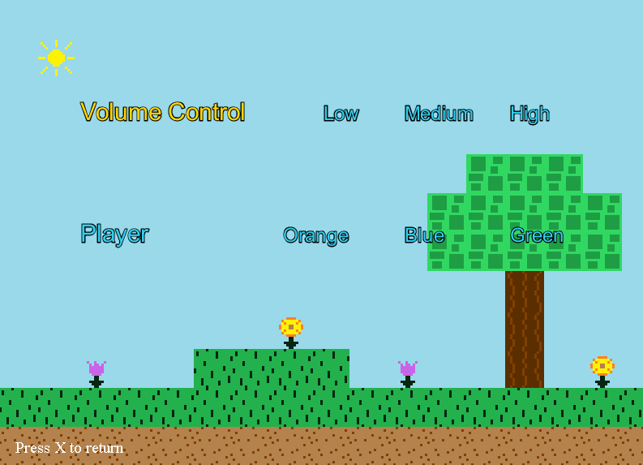

# Navigation Structure
{: .no_toc }

## Table of contents
{: .no_toc .text-delta }

1. TOC
{:toc}

---

# Options Screen

The screen handles the logic and graphics related to the options screen that exists on the main menu.

The class file for it is `OptionsScreen.java` which can be found in the `Screens` package.

## Functionality

The options screen's only real job is to allow the player to select between updating volume level and the image the cat displays.
Upon selecting an option, `OptionsScreen` will change `ScreenCoordinator's` game state which will force it to update the volume/cat.

## Graphics

The background of the screen uses a `Map` specifically made for it (`TitleScreenMap.java` in the `Maps` package), which is the same type of `Map` class which
is used when actually playing the platformer game. While any image could have been used, I thought it'd be more fun to use a map as the background.

