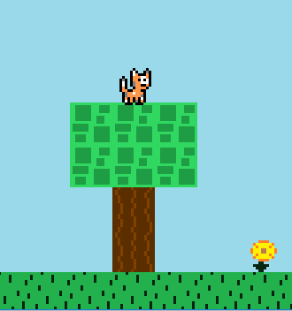

# Navigation Structure

{: .no_toc }

## Table of contents

{: .no_toc .text-delta }

1. TOC {:toc}

---

# Drawing Graphics

## Painting an image to the JPanel

The `GraphicsHandler` class is passed into the `draw` method of every class, and is used to paint an image to the engine's backing JPanel. The engine sets it up on creation, and from that point on it can be used in any `draw` method in any class that needs it.

The `GraphicsHandler` class has many methods, but the following methods are the most commonly used:

- **drawRectangle** -- draws a hollow rectangle to the screen, can supply border color can optionally supply border thickness
- **drawFilledRectangle** -- draws a filled rectangle to the screen, can optionally set border color and border thickness
- **drawImage** -- draws an image to the screen, can optionally flip the image horizontally, vertically, or both
- **drawString** -- draws a text string to the screen
- **drawStringWithOutline** -- draws a text string to the screen with an outline (works decently enough, but it's not perfect looking)

Most of the time in game, the `drawImage` method is what will be used:

```java
public void draw(GraphicsHandler graphicsHandler){
        // draw image at specified location
        graphicsHandler.drawImage(image,xLocation,yLocation,imageWidth,imageHeight);

        // draw image at specified location flipped horizontally
        graphicsHandler.drawImage(image,xLocation,yLocation,imageWidth,imageHeight,ImageEffect.FLIP_HORIZONTAL);
        }
```

The `ImageEffect` enum contains all the other image effects that can be applied to an image besides flipping it horizontally.

## Draw Order

Something important to keep in mind is that the order that graphics are drawn to the JPanel matters, because each graphic is "pasted" on over whatever was there beforehand.

For an in game example, the map tiles (light blue sky, tree, etc) in the below image are drawn BEFORE the cat image to ensure that the map tiles do not cover up the cat making it not visible. This also ensures that every time the cat moves, the map tiles continue to stay behind it.


