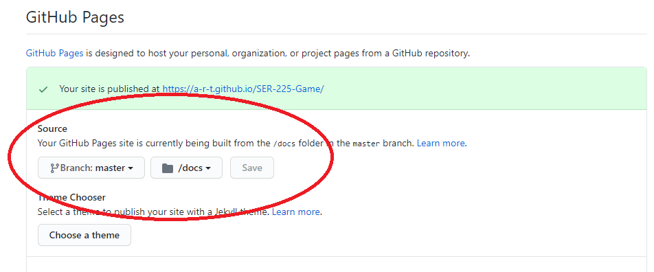

# Navigation Structure

{: .no_toc }

## Table of contents

{: .no_toc .text-delta }

1. TOC {:toc}

---

# How To Use This Site

This site contains documentation for various facets of this game created for Quinnipiac's SER225 class, mainly going over how the game is made and how the code works. Games tend to be more complicated than the average application due to how much is going on, the constant cycling of the game loop that has to always be looking out for user input, and performance mattering due a slow game directly affecting the player. For that reason, it is important to understand (at least at a high-level) the game engine and game logic code in order to successfully develop this game further.

Click a link from the sidebar on the left of this site to be taken to its respective webpage.

The [Game Engine](../GameEngine/game-engine.md) section contains documents that detail the game engine code (how the game loop cycle works, etc.).

The [Game Code Details](../GameCodeDetails/game-code-details.md) section contains documents that detail the game logic code (map, player, enemies, etc).

Other pages should be self-explanatory.

The search bar at the top of this site is your best friend. Without it, you will waste a lot of time combing through pages of text trying to find what you're looking for. CTRL+F for keywords is another necessity for finding what you're looking for. If you are looking at code and do not understand something, try typing it into the search of this website and see what comes up. Looking through subsections on the sidebar can also help you find the correct pages you are looking for if in need of adding a feature where you have a general idea of how to do it but aren't sure of which class contains the logic that needs to be added to/changed. Please do not attempt to read through all the pages in this site all at once -- this site is designed to be used as a "look up" reference similar to situations when you need to consult google to find an answer.

## How was this site made?

GitHub has a platform called [GitHub Pages](https://pages.github.com/) that gives every GitHub user one free domain, and each repository is given one free project site route. GitHub Pages will then, for free, host a website specified in that repo. In the `docs` folder of this project is where GitHub Pages is set to look to in order to build and host the website code.

While normally websites are written using HTML, GitHub pages uses a web framework called [Jekyll](https://jekyllrb.com/) that transforms plain text into HTML which can then be rendered in a web browser. In particular, Jekyll will translate [markdown](https://www.markdownguide.org/basic-syntax/) formatted text files into HTML, which is AWESOME because writing in markdown is MUCH easier than dealing with HTML tags. There is a bit of a learning curve to use Jekyll properly (something I didn't know how to use before attempting to make this site), but once I got it all figured out, things went smoothly and the website came out pretty good in my opinion. I used a Jekyll theme called [Just the Docs](https://pmarsceill.github.io/just-the-docs/) for this website, which gave me access to various features and already implemented code that made it a lot easier to build up the site.

You are also allowed to embed HTML right into the markdown files, which I did once in a while if I needed do to an animation or something, but otherwise there wasn't much of a need to do so as this is a static site and doesn't need much logic to fulfill its purpose.

## Changing website information

Each page of the website has an associated `.md` (markdown) file inside the `docs` folder. It's just a matter of finding the correct one for the page to edit and then actually changing the text to update the site. Only changes to the `master` branch will be applied to the website.

If you forked this repo and want GitHub to create a new web page for your version of the game (that will not conflict with this existing website), you need to go to your GitHub repo's Settings, go to the GitHub Pages section, and set the source to point to the `docs` folder instead of `none`. That setting should also tell you the new url that will lead to your project's site, which will be separate from mine.

If you are creating a new web page, I recommend copying an existing page's first several lines and edit them to make sure it fits properly in the site (the theme will automatically add properly added pages to the sidebar).