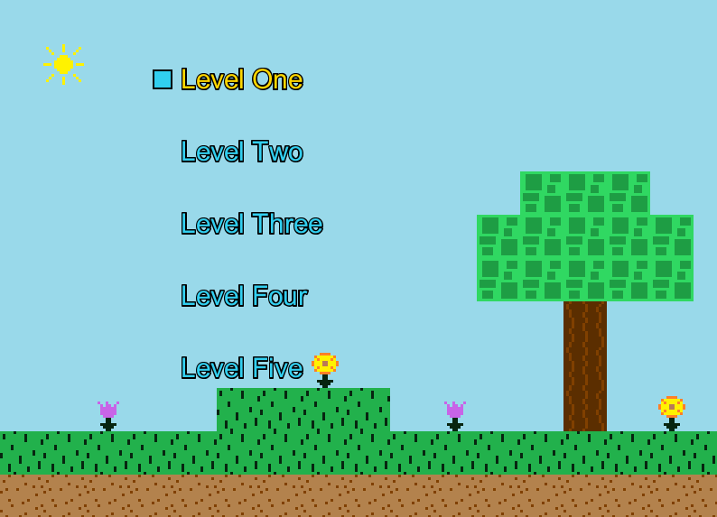

# Navigation Structure
{: .no_toc }

## Table of contents
{: .no_toc .text-delta }

1. TOC
{:toc}

---

# Level Select Screen

The screen handles the logic and graphics related to the screen that is loaded upon the user selecting level select.

The class file for it is `LevelSelect.java` which can be found in the `Screens` package.

## Functionality

The level select screen's only real job is to allow the player to select between the five levels of the game.
Upon selecting an option, `LevelSelectScreen` will change `ScreenCoordinator's` game state which will force it to load the appropriate screen based
on the option selected.

## Graphics

The background of the screen uses a `Map` specifically made for it (`TitleScreenMap.java` in the `Maps` package), which is the same type of `Map` class which
is used when actually playing the platformer game. While any image could have been used, I thought it'd be more fun to use a map as the background.

